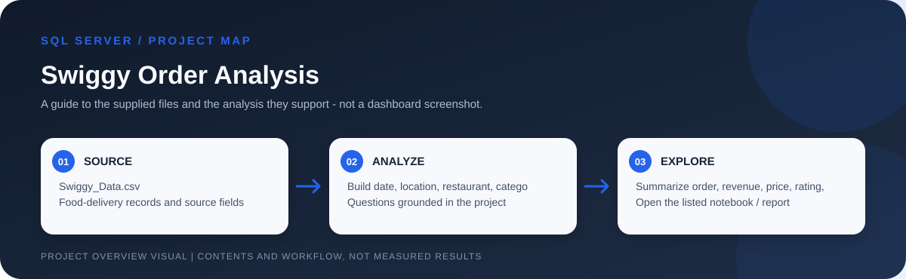

# Swiggy Food-Delivery Sales Analysis



> Workflow illustration only; it is not a dashboard screenshot or a source of measured results.


> **Question:** How do order volume, menu categories, restaurants, locations, prices, and ratings vary across the supplied food-delivery records?

This SQL Server project uses **197,430 source rows** to demonstrate data-quality checks and dimensional modeling for food-delivery analysis. It builds date, location, restaurant, category, and dish dimensions around a central fact table, then queries sales and order patterns by time, geography, cuisine, restaurant, dish, and price band.

## Analytical workflow

```mermaid
flowchart LR
    A[Swiggy_Data.csv<br/>197,430 source rows] --> B[Stage as swiggy_data]
    B --> C[Check nulls and blanks<br/>review duplicate rows]
    C --> D[Build dimensions<br/>date  |  location  |  restaurant  |  category  |  dish]
    D --> E[Populate fact_swiggy_orders<br/>price  |  rating  |  rating count]
    E --> F[Trend and mix analysis<br/>time  |  geography  |  food  |  spend  |  ratings]
```

## Business questions represented in the project

- What are total order rows, revenue in INR millions, average dish price, and average rating?
- How does order volume vary by month, quarter, year, and day of week?
- Which cities and restaurants have the most recorded orders?
- How does revenue vary by state, and which categories/cuisines and dishes have the most orders?
- How are records distributed across spend bands: under 100, 100-199, 200-299, 300-499, and 500+?
- What does the rating-count distribution from 1 to 5 look like, and how do category order volume and average rating compare?

These questions come from the included requirements document; the README does not assert specific output values that are not reported in the repository.

## Files in this project

| File | What it contributes |
| --- | --- |
| [`Swiggy_SQL.sql`](<./Swiggy_SQL.sql>) | SQL Server cleaning checks, a duplicate-row deletion step, creation and population of five dimensions plus `fact_swiggy_orders`, KPI queries, and granular time/location/category/price/rating analysis. |
| [`Swiggy_Data.csv`](<./Swiggy_Data.csv>) | 197,430 source records covering state, city, order date, restaurant, location, category, dish, price, rating, and rating count. |
| [`Business Requirements.docx`](<./Business Requirements.docx>) | The analysis brief: validation, star-schema design, KPI list, and requested business breakdowns. |
| [`SQL Queries_SWIGGY SALES ANALYSIS.docx`](<./SQL Queries_SWIGGY SALES ANALYSIS.docx>) | A companion document containing the query workflow and analysis requirements. |

## Important setup before execution

The CSV headers do **not** match the SQL names verbatim. For example, the CSV uses `Order Date`, `Price (INR)`, `Restaurant Name`, and `Rating Count`, while the SQL expects names such as `Order_Date`, `Price_INR`, `Restaurant_Name`, and `Rating_Count`. Before running the script, create a staging table and map/rename the CSV columns (or update the SQL consistently); also assign compatible date, decimal, and integer types. The script assumes that this staging table is already named `swiggy_data`.

The script deletes duplicate rows from `swiggy_data` using a `DELETE` CTE. Load into a disposable staging copy and inspect the duplicate definition before executing that statement. The `ROW_NUMBER` ordering is unspecified, so the retained duplicate is not deterministic when otherwise-identical rows are present. Dimension/fact `CREATE TABLE` and `INSERT` statements also need a fresh or deliberately reset database to avoid rerun conflicts.

## Grain and interpretation

The fact table creates a generated `order_id` for each loaded source row; the source file does not show a separate order identifier. Confirm that one source row truly represents one order before interpreting `COUNT(*)` as unique customers or customer checkouts. `Rating_Count` is an input field; it should not be confused with the number of orders. Results describe the supplied extract and do not imply live Swiggy data.
